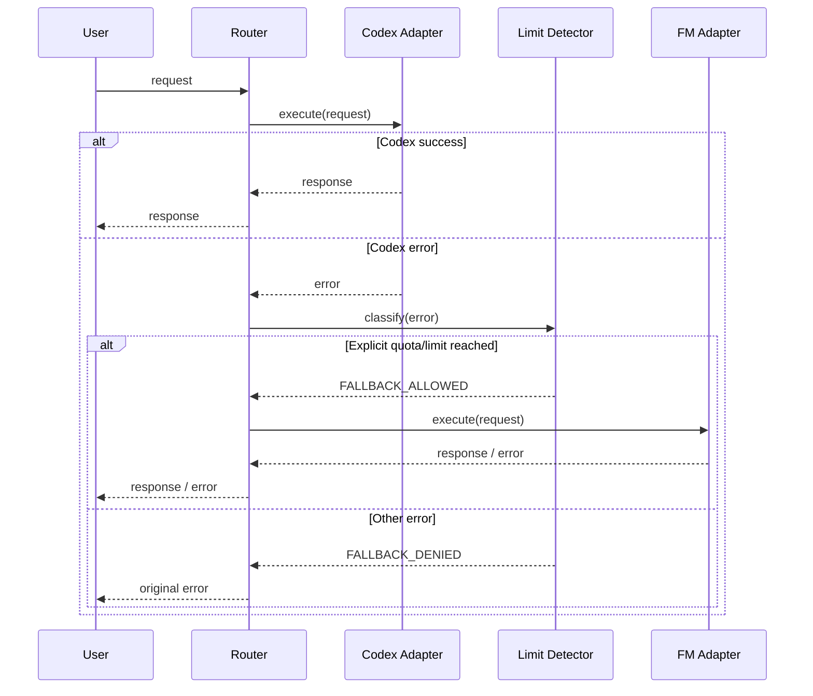

# fm-co

Codex の利用上限に到達したとき、作業を中断せず **FM Chat に安全にフォールバックするための構成**を定義するプロジェクトです。

> [!IMPORTANT]
> 現在、このリポジトリにフォールバック機能の実装コードはありません。
> 本 README は要件・基本設計・詳細設計・実装方針を定義するものです。

## 目的

通常時は Codex を使用し、Codex が**利用上限到達を明示的に返した場合のみ** FM Chat に切り替える仕組みを目指します。

目標とする動作:

```text
User
  |
  v
fm-co
  |
  +--> Codex
  |      |
  |      +-- success --------------------> response
  |      |
  |      +-- explicit quota/limit error
  |                |
  |                v
  +------------> FM Chat ----------------> response
```

## 現在の機能

現時点では次の状態です。

- Codex から FM Chat への自動切替: **未実装**
- Codex の利用上限検出: **未実装**
- FM Chat クライアント: **未実装**
- 設定ファイル/CLI: **未実装**
- テスト: **未実装**
- 本リポジトリ: **設計・実装準備段階**

Codex 自体が FM Chat を直接サポートしている、または Codex の内部機能として FM Chat が利用できる、という意味ではありません。fm-co 側に明示的なフォールバック層を実装する想定です。

## 基本設計

### 1. コンポーネント

| コンポーネント | 責務 |
| --- | --- |
| Router | Codex を優先して呼び出し、結果を判定する |
| Codex Adapter | Codex へのリクエスト/レスポンスを抽象化する |
| Limit Detector | 利用上限・クォータ到達を判定する |
| FM Adapter | FM Chat へのリクエスト/レスポンスを抽象化する |
| Config | 接続先、モデル、タイムアウト等を管理する |
| Logger | シークレットを除外した運用ログを記録する |

### 2. フォールバック方針

FM Chat へ切り替えるのは、Codex 側から取得した**公式かつ明示的な利用上限・クォータ到達シグナル**を判定できた場合に限定します。

以下は自動フォールバック対象にしません。

- 認証エラー
- 権限不足
- 入力不正
- ネットワーク障害
- Codex 側の一時的な 5xx
- 原因不明の例外
- 単なるタイムアウト
- 実装側のバグ

これにより、「Codex の失敗なら何でも FM に送る」という誤動作を避けます。

### 3. フェイルセーフ

- Codex の再試行は回数上限を設ける
- FM Chat の再試行も回数上限を設ける
- Codex → FM → Codex のような循環切替は禁止する
- 判定不能なエラーはそのまま呼び出し元へ返す
- FM Chat も利用不可なら、原因を区別して終了する

## 詳細設計

### リクエストフロー



### エラー分類

内部では最低限、次のような分類を想定します。

```text
SUCCESS
CODEX_QUOTA_EXCEEDED
CODEX_RATE_LIMITED
AUTHENTICATION_ERROR
PERMISSION_ERROR
INVALID_REQUEST
NETWORK_ERROR
TIMEOUT
UPSTREAM_ERROR
UNKNOWN_ERROR
FM_ERROR
```

ただし、`CODEX_RATE_LIMITED` を即座に FM フォールバックへ結び付けるかは、実装時に利用している公式 API/CLI の仕様を確認して決定します。一時的なレート制限と、長時間継続する利用上限は同一ではないためです。

### 判定ルール

フォールバック判定では、次の優先順位を使用します。

1. 公式 SDK/API/CLI が提供する構造化エラーコード
2. 公式レスポンスの HTTP ステータスとエラー種別
3. 公式に仕様化された終了コード
4. 上記で判定できない場合は `UNKNOWN_ERROR`

エラーメッセージ本文の文字列一致だけに依存した判定は原則として使用しません。文言変更やローカライズで壊れる可能性があるためです。

## 設定案

実装時には、環境変数または設定ファイルから次の値を渡せるようにします。

```env
FM_CO_PRIMARY_PROVIDER=codex
FM_CO_FALLBACK_PROVIDER=fm

FM_CO_CODEX_MODEL=
FM_CO_FM_MODEL=

FM_CO_REQUEST_TIMEOUT_SECONDS=120
FM_CO_CODEX_MAX_RETRIES=1
FM_CO_FM_MAX_RETRIES=1

FM_CO_LOG_LEVEL=info
```

認証情報は設定ファイルへ平文保存せず、環境変数・OS のシークレットストア・CI/CD の Secret 機能などを利用します。

## セキュリティ

以下を必須要件とします。

- API キー、アクセストークン、Cookie をログ出力しない
- Authorization ヘッダーをマスクする
- プロンプト本文のログ保存は既定で無効にする
- FM Chat へ送信する前に、送信先が意図したエンドポイントであることを検証する
- TLS 証明書検証を無効化しない
- 依存パッケージはサポート対象の最新安定版を基準に検証する
- 依存バージョン更新時は回帰テストを実施する

## 互換性方針

Codex、FM Chat、SDK、CLI の仕様は変更される可能性があります。

そのため実装では以下を行います。

- 未公開 API や内部実装に依存しない
- 公式に公開されたインターフェースを優先する
- サポート対象バージョンを CI で固定・検証する
- 最新安定版への更新を定期的に検証する
- エラーコードやレスポンス形式の変更をテストで検知する

## テスト方針

### Unit Test

- Codex 正常時に FM を呼ばない
- 利用上限到達時だけ FM を呼ぶ
- 認証エラー時に FM を呼ばない
- タイムアウト時に無条件フォールバックしない
- FM 失敗時に無限リトライしない
- シークレットがログに含まれない

### Integration Test

Codex/FＭ の実サービスを直接前提にせず、まずはモック/スタブで以下を再現します。

- Codex success
- explicit quota exceeded
- temporary rate limit
- authentication error
- network failure
- FM success
- FM failure

### Adversarial Review

実装前後に、少なくとも以下を確認します。

- 利用上限ではない障害を誤判定していないか
- エラーメッセージ変更だけで判定不能にならないか
- FM 側障害で再帰・無限ループしないか
- 同一プロンプトが意図せず複数回実行されないか
- ツール実行を伴うリクエストが二重実行されないか
- 秘密情報や個人情報がフォールバック先へ意図せず転送されないか
- Codex と FM で機能差がある場合に結果を同等と誤認しないか

## 実装ロードマップ

- [x] README に要件と設計を定義
- [ ] Codex Adapter を実装
- [ ] FM Adapter を実装
- [ ] Limit Detector を実装
- [ ] Router を実装
- [ ] Config/Secret 管理を実装
- [ ] Unit Test を追加
- [ ] Integration Test を追加
- [ ] CLI を追加
- [ ] CI を追加
- [ ] 実環境で互換性を検証

## 想定ディレクトリ構成

実装時の初期案です。

```text
fm-co/
├── README.md
├── src/
│   ├── router/
│   ├── adapters/
│   │   ├── codex/
│   │   └── fm/
│   ├── errors/
│   ├── config/
│   └── logging/
├── tests/
│   ├── unit/
│   └── integration/
└── .github/
    └── workflows/
```

言語・ランタイム・SDK は、FM Chat の正式な接続方式と Codex 側の公式インターフェースを確認してから決定します。

## 非目標

fm-co は、サービス側の利用上限を不正に回避するためのものではありません。

目的は、利用可能な別プロバイダーへ**明示的かつ安全に処理を切り替えるアプリケーションレベルのフォールバック**を実装することです。

## 開発フロー

変更は Issue と Pull Request を経由します。

1. Issue で目的・受け入れ条件を定義
2. 作業ブランチを作成
3. 基本設計・詳細設計を確認
4. 実装とテスト
5. 敵対レビュー
6. Pull Request
7. CI とレビュー通過後にマージ

関連 Issue: #1

## License

ライセンスはまだ定義されていません。公開・再利用条件を明確にする場合は、別途 LICENSE を追加してください。
